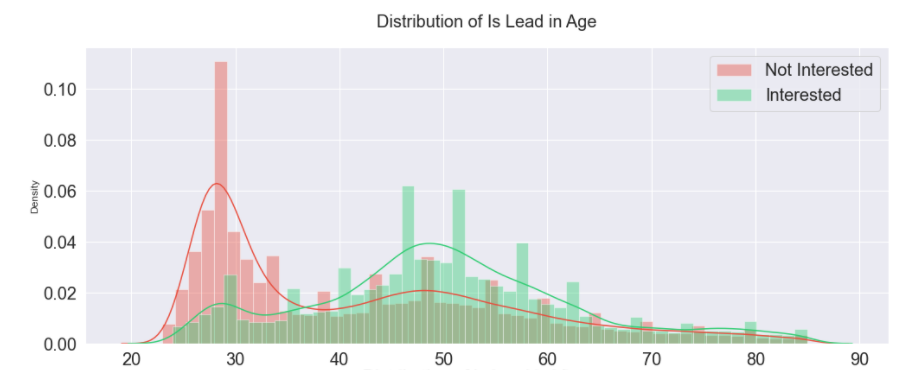
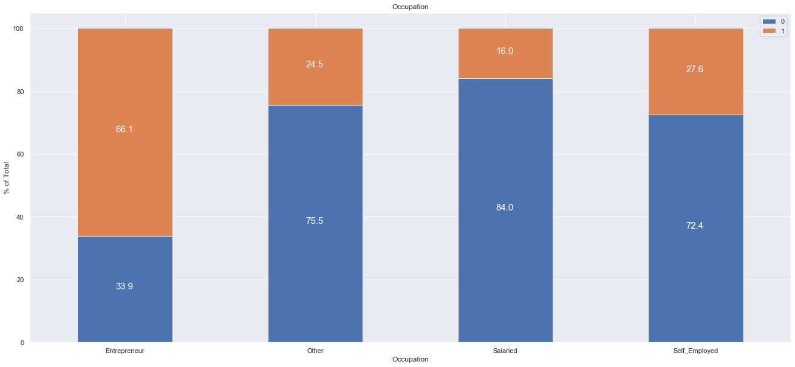
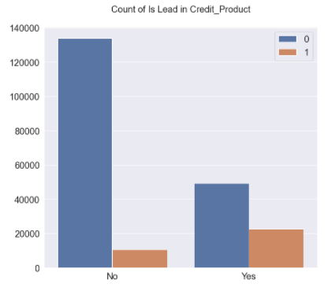

# Credit Card Lead Prediction

## :memo: Description

- This is a classification machine learning problem to identify the customers of a mid-sized bank that could show a higher intent towards a recommended credit card 	:credit_card:.
- In this project we have combined the predictions made by **XGBOOST** and **LightGBM** using **Stacking**. 

## :file_folder: Code
- [Credit Card Lead Prediction.ipynb](https://github.com/AbhishekGit-hash/Credit-Card-Lead-Prediction/blob/master/Credit%20Card%20Lead%20Prediction.ipynb)
- [Credit Card Lead Prediction.ipynb (nbviewer)](https://nbviewer.org/github/AbhishekGit-hash/Credit-Card-Lead-Prediction/blob/master/Credit%20Card%20Lead%20Prediction.ipynb) (_Click on this link if the notebook doesnot load on Github._)

## :hourglass: Dataset

The dataset **`train.csv`** is used for training. The train dataset had 2,45,725 records with 11 features. 
The dataset consisted the following attributes : 
- **ID** : Unique Identifier for a row
- **Gender** : Gender of the Customer
- **Age** : Age of the Customer (in Years)
- **Region_Code** : Code of the Region for the customers
- **Occupation** : Occupation Type for the customer
- **Channel_Code** : Acquisition Channel Code for the Customer  (Encoded)
- **Vintage** : Vintage for the Customer (In Months)
- **Credit_Product** : If the Customer has any active credit product (Home loan, Personal loan, Credit Card etc.)
- **Avg_Account_Balance** : Average Account Balance for the Customer in last 12 Months
- **Is_Active** : If the Customer is Active in last 3 Months
- **Is_Lead(Target)** : If the Customer is interested for the Credit Card (0 : Customer is not interested , 1 : Customer is interested)

## :page_with_curl: Technical Overview
The project has been divided into the following steps :
### 1. Exploratory Data Analysis
In this step features having missing values and outliers, target variable distribution, numerical feature distribution, categorical feature distribution, Univariate and Bivariate Analysis was performed. 
**Some of the data insights are given below**. _(For the detail EDA please refer to the [ipynb notebook](https://nbviewer.org/github/AbhishekGit-hash/Credit-Card-Lead-Prediction/blob/master/Credit%20Card%20Lead%20Prediction.ipynb))_
- Customers aged between 40-60 have greater interest in credit cards whereas customers in their 20s and 30s and less interested  
  
- Salaried person are less likely to take up credit cards. Only among Entrepreneur the number of customers interested to take up credit cards is more. **66%** of total Customers falling in **Entrepreneural** category in Occupation have shown interest in the past followed by **27.6%** Self Employed, **24.5%** in Others category and **16%** Salaried.There are only **2 Entrepreneurs who don't have any credit product**.  
  
- Number of Customers having credit products who are interested in Credit Card is more than those who donot have a Credit Product.  
  

### 2. Data Cleaning
- The Missing Value in the **Credit_Product** column is imputed with **No_Info**
### 3. Feature Engineering
- The categorical features (Gender, Region_Code, Occupation, Channel_Code, Credit_Product, Is_Active) were **One Hot Encoded**.
### 4. Oversampling (Handling Class Imbalance in Target Feature)
- About **76.27%** customers are not interested in credit card, and about **23.72%** are interested in credit card. To address this imbalance Oversampling techniques like **SMOTE** is used.
### 5. Modelling and Hyperparameter Tuning
* In Modelling both LightGBM and Xgboost is used. 
* For combining the predictions made by XGBoost and Light GBM, stacking is used
* The models are tuned using Randomized Search CV
* To check for overfitting 5 kfold cross validation was performed

### :open_book: [Approach Document.pdf](https://github.com/AbhishekGit-hash/Credit-Card-Lead-Prediction/blob/master/Approach%20Document.pdf)

## 📈 Modelling and Evaluation
* In this project **ROC-AUC score** was used as evaluation metric.
* The Xgboost model gave a ROC-AUC score of 0.879 while the LightGBM model gave a ROC-AUC score of 0.876 

## 	:clipboard: Results
### 1. Feature Correlations
**Age** and **Vintage** has highest correlation (__0.63__) in train dataset and (__0.62__) in test dataset.  
 
### 2. Feature Importance
#### XGBoost
In the **XGBoost** model, the top 5 features of importance are : **Avg_Account_Balance**, **Vintage**, **Age**, **Is_Active_No** and **Credit_Product_Yes**. 
 
#### LightGBM
In the **LightGBM** model, the top 5 features of importance are : **Vintage**, **Age**, **Occupation_Other**, **Avg_Account_Balance** and **Occupation_Self_Employed**.  
 

## :black_nib: Authors
- Abhishek Chowdhury - [Github Profile](https://github.com/AbhishekGit-hash)
